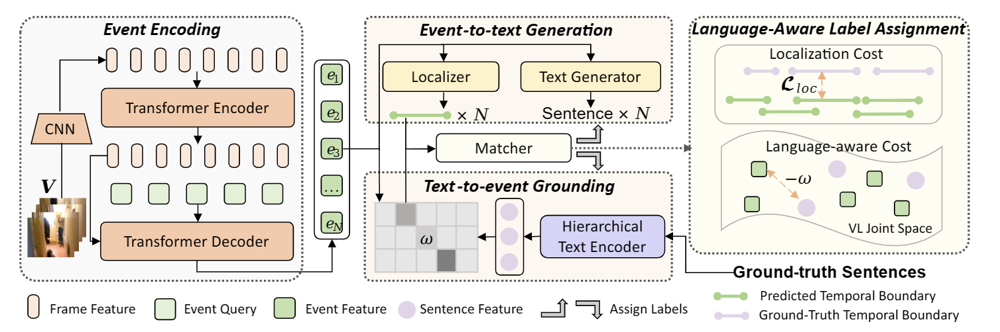

# Learning Grounded Vision-Language Representation for Versatile Understanding in Untrimmed Videos

<div align=left>
<a src="https://img.shields.io/badge/arXiv-2303.06378-b31b1b.svg" href="https://arxiv.org/abs/2303.06378">

</a>
</div>

Official implementation for paper [Learning Grounded Vision-Language Representation for Versatile Understanding in Untrimmed Videos](https://arxiv.org/abs/2303.06378)

## Introduction
GVL is grounded video-language representation learning framework for untrimmed videos, which can automatically detects informative events and effectively excavates the alignments between multi-sentence descriptions and corresponding event segments. GVL is easily extensible to tasks covering visually-grounded language understanding and generation. We
achieve state-of-the-art dense video captioning performance on ActivityNet Captions, YouCook2 and YouMakeup, and compet-
itive performance on several other language generation and understanding tasks. Our method also achieved 1st place in
both [MTVG](https://codalab.lisn.upsaclay.fr/competitions/5244) and [MDVC](https://codalab.lisn.upsaclay.fr/competitions/5102) tracks of the Person In Context (PIC) Challenge 2022.



## Getting Started
### Prepare Environment
```bash
git clone --recursive https://github.com/zjr2000/GVL.git
conda create -n gvl python=3.7
conda activate gvl
conda install pytorch==1.7.1 torchvision==0.8.2 cudatoolkit=10.1 -c pytorch
conda install ffmpeg
pip install -r requirements.txt
```
### Compile the deformable attention layer
```bash
cd pdvc/ops
sh make.sh
```
### Download visual features
1. Download C3D features and TSP features ActivityNet Captions
```bash
cd data/anet/features
bash download_anet_c3d.sh
bash download_tsp_features.sh
```

2. Download C3D features for TACoS
Download ```tall_c3d_features.hdf5``` from [box](https://rochester.app.box.com/s/8znalh6y5e82oml2lr7to8s6ntab6mav/folder/137471786054) provided by [2D-TAN](https://github.com/microsoft/VideoX/tree/master/2D-TAN). Put it under ```data/tacos/features```.

```bash
cd data/tacos/features
python convert_c3d_h5_to_npy.py
```
3. Download TSN features for YouCook2
```bash
cd data/yc2/features
bash download_yc2_tsn_features.sh
```
4. Download [official](https://github.com/AIM3-RUC/Youmakeup_Challenge2022) provided I3D features for YouMakeup from [google drive](https://drive.google.com/open?id=1cT5MKcmSmqS6xC_i2dI2wbJ3n7mdFh7o). Put ```makeup_i3d_rgb_stride_1s.hdf5``` under ```data/youmakeup/features```.
```bash
cd data/youmakeup/features
python convert_i3d_h5_to_npy.py
```
**You can also extract features for your own dataset with this [feature extractor](https://github.com/zjr2000/Untrimmed-Video-Feature-Extractor)**
## Training
```bash
config_path=cfgs/anet_tsp_ssvg.yml
gpu_id=0
python train.py --cfg ${config_path} --gpu_id ${gpu_id}
# Checkpoints and logs will be saved under "save/" folder.
```
## Validation
Evaluate dense captioning performance
```bash
eval_folder=YOUR_EVAL_FOLDER # specify the folder to be evaluated
model_path=save/${eval_folder}/model-best-dvc.pth
python eval.py --eval_folder ${eval_folder} \
--gpu_id=YOUR_GPU_ID \
--eval_model_path=${model_path} \
--eval_batch_size=16 \
--eval_caption_file=data/anet/captiondata/val_1.json \
--eval_save_dir save \
```
Evaluate video grounding performance
```bash
eval_folder=YOUR_EVAL_FOLDER # specify the folder to be evaluated
model_path=save/${eval_folder}/model-best-grounding.pth
python eval.py --eval_folder ${eval_folder} \
--gpu_id=YOUR_GPU_ID \
--eval_model_path=${model_path} \
--eval_batch_size=16 \
--eval_disable_captioning \
--eval_caption_file=data/anet/captiondata/val_2.json \
--eval_save_dir save \
--eval_gt_file_for_grounding data/anet/captiondata/grounding/val2_for_grounding.json
```
## Performance
We provide several checkpoints for reproduce our experiment results. You can download them from [google drive](https://drive.google.com/drive/folders/1vvr4kYI7xGklOdgyQU5L34W2ZxRQzspK?usp=sharing), put the them under ```save/``` and use the above scripts to evaluate them.

## Citation
If you find this repo helpful, please consider citing:
```
@article{wang2023learning,
  title={Learning Grounded Vision-Language Representation for Versatile Understanding in Untrimmed Videos},
  author={Wang, Teng and Zhang, Jinrui and Zheng, Feng and Jiang, Wenhao and Cheng, Ran and Luo, Ping},
  journal={arXiv preprint arXiv:2303.06378},
  year={2023}
}
```
## Acknowledgement
This repo is mainly based on [PDVC](https://github.com/ttengwang/PDVC) and [Deformable DETR](https://github.com/fundamentalvision/Deformable-DETR). We thank the authors for their efforts.